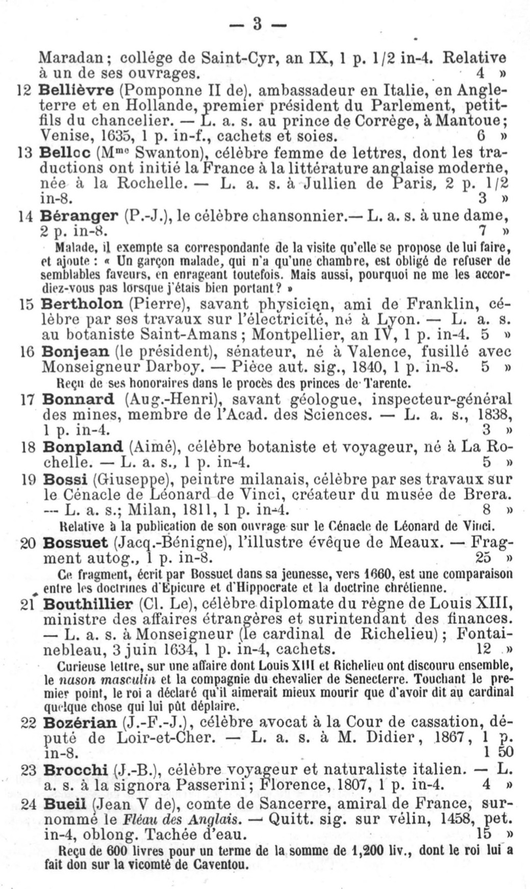
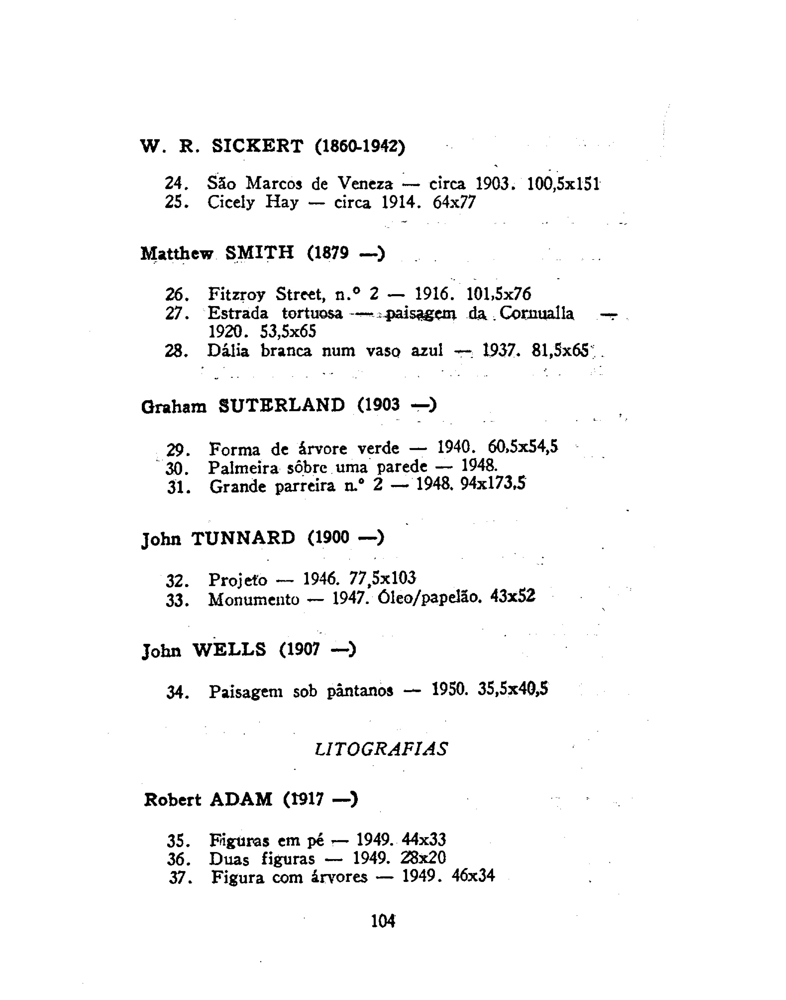

# GROBID-Cat

 
## Purpose

GROBID-Cat is a GROBID-Dictionaires fork, implementing a java machine learning library, for structuring digitized catalogues. It allows the parsing, extraction and structuring of text information in such resources. 

## Approach

GROBID-Cat is based on cascading CRF models. 

## Input/Output

GROBID-Dictionaries takes as input digitized catalogues in PDF format. Each model of the aforementioned components generates a TEI P5-encoded hierarchy of the different recognized text structures at that specific cascading level.
{:height="50%" width="50%"}
{:height="50%" width="50%"}

## To Cite

Mohamed Khemakhem, Luca Foppiano, Laurent Romary. Automatic Extraction of TEI Structures in Digitized Lexical Resources using Conditional Random Fields. electronic lexicography, eLex 2017, Sep 2017, Leiden, Netherlands. [hal-01508868v2](https://hal.archives-ouvertes.fr/hal-01508868v2)

Mohamed Khemakhem, Axel Herold, Laurent Romary. Enhancing Usability for Automatically Structuring Digitised Dictionaries. GLOBALEX workshop at LREC 2018, May 2018, Miyazaki, Japan. 2018.  [hal-01708137v2](https://hal.archives-ouvertes.fr/hal-01708137v2)

## More Reading
Hervé Bohbot, Francesca Frontini, Giancarlo Luxardo, Mohamed Khemakhem, Laurent Romary. Presenting the Nénufar Project: a Diachronic Digital Edition of the Petit Larousse Illustré. GLOBALEX 2018 - Globalex workshop at LREC2018, May 2018, Miyazaki, Japan. [hal-01728328](https://hal.archives-ouvertes.fr/hal-01728328v1)

Mohamed Khemakhem, Carmen Brando, Laurent Romary, Frédérique Mélanie-Becquet, Jean-Luc Pinol. Fueling Time Machine: Information Extraction from Retro-Digitised Address Directories. JADH2018 "Leveraging Open Data", Sep 2018, Tokyo, Japan.  [hal-01814189](https://hal.archives-ouvertes.fr/hal-01814189v1)

Mohamed Khemakhem, Laurent Romary, Simon Gabay, Hervé Bohbot, Francesca Frontini, et al.. Automatically Encoding Encyclopedic-like Resources in TEI. The annual TEI Conference and Members Meeting, Sep 2018, Tokyo, Japan.[hal-01819505](https://hal.archives-ouvertes.fr/hal-01819505v1)

David Lindemann, Mohamed Khemakhem, Laurent Romary. Retro-digitizing and Automatically Structuring a Large Bibliography Collection. European Association for Digital Humanities (EADH) Conference, Dec 2018, Galway, Ireland. [hal-01941534](https://hal.archives-ouvertes.fr/hal-01941534v1)

## Documentation
For more expert and development uses, the documentation of the tool is detailed [here](http://grobid-dictionaries.readthedocs.io/en/latest/)

## Contact
Mohamed Khemakhem (<mohamed.khemakhem@inria.fr>), Laurent Romary (<laurent.romary@inria.fr>), Simon Gabay (<simon.gabay@unine.ch>), Béatrice Joyeux-Prunel (<Beatrice.Joyeux-Prunel@unige.ch>), Léa saint-raymond (<lea.saint-raymond@ens.fr>)
